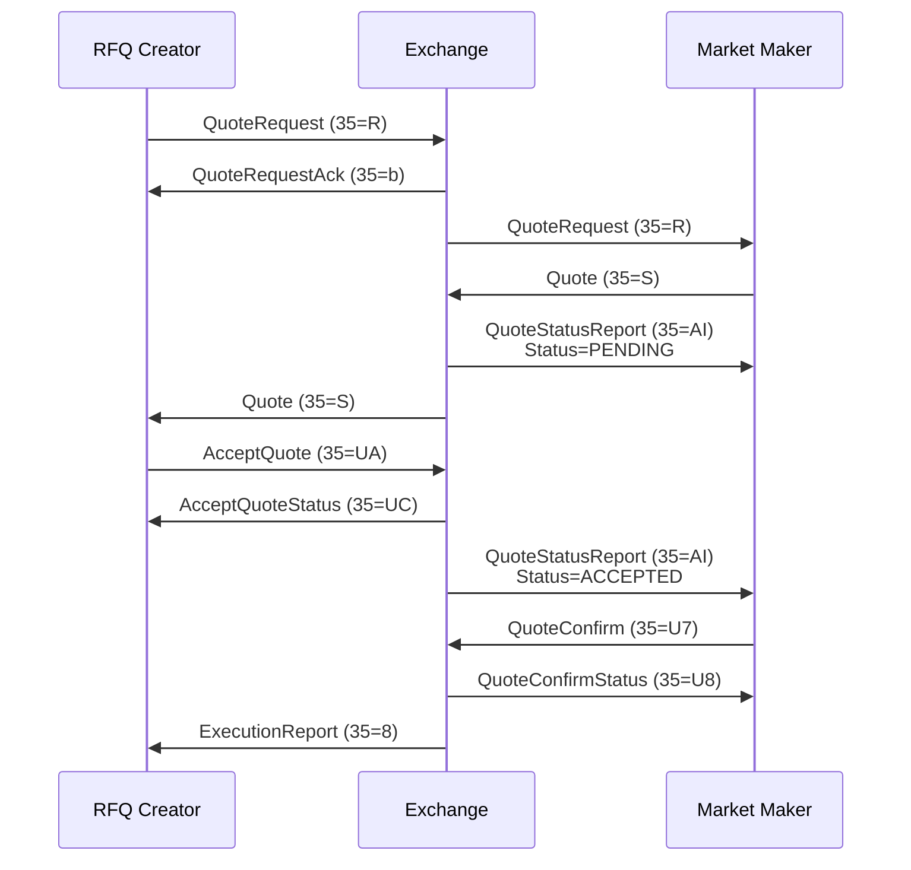

> ## Documentation Index
> Fetch the complete documentation index at: https://docs.kalshi.com/llms.txt
> Use this file to discover all available pages before exploring further.

# RFQ

> Request for Quote functionality for RFQ creators and market makers

## Overview

RFQ functionality involves two types of participants connecting via different FIX sessions:

**RFQ Creators** - Users who want to trade via RFQ (connect via **RT mode**):

1. Create RFQ via QuoteRequest (35=R)
2. Receive quotes from market makers via Quote (35=S)
3. Accept a quote via AcceptQuote (35=UA)
4. Receive trade execution via ExecutionReport (35=8)

**Market Makers** - Users who provide quotes (connect via **RfqMode**):

1. Receive QuoteRequest from exchange
2. Respond with Quote (35=S)
3. Receive acceptance notification
4. Confirm execution via QuoteConfirm (35=U7)

<Info>
  RFQ Creators use the KalshiRT endpoint (same as order entry), which provides message persistence and retransmission support. Market Makers use the KalshiRFQ endpoint to receive RFQ broadcasts and submit quotes.
</Info>

## Message Flow

### Full RFQ Flow (Creator via FIX)



## QuoteRequest (35=R)

This message is used bidirectionally:

* **Creator → Exchange**: Create a new RFQ
* **Exchange → Market Makers**: Notify of new RFQ

### Creator → Exchange (Create RFQ)

**Message body**

| Tag   | Name                             | Type    | Required | Description                                                                                                      |
| ----- | -------------------------------- | ------- | -------- | ---------------------------------------------------------------------------------------------------------------- |
| 131   | QuoteReqId                       | UUID    | Y        | Client-assigned RFQ identifier                                                                                   |
| 146   | NoRelatedSym                     | Integer | Y        | Number of entries in the repeating group below. Must be 1                                                        |
| 79    | AllocAccount                     | Integer | N        | Subaccount number (0-63) for direct members. Alternative to NoPartyIDs; omit or set to 0 for the primary account |
| 20180 | MultivariateCollectionTicker     | String  | C        | Collection ticker for parlay/MVE markets. Use instead of Symbol                                                  |
| 20181 | NoMultivariateSelectedLegs       | Integer | C        | Number of MVE legs (repeating group). Required with 20180                                                        |
| 20182 | MultivariateSelectedEventTicker  | String  | Y        | Event ticker for the leg                                                                                         |
| 20183 | MultivariateSelectedMarketTicker | String  | Y        | Market ticker for the leg                                                                                        |
| 20184 | MultivariateSelectedSide         | String  | Y        | Side for the leg ("yes" or "no")                                                                                 |

**Inside the `146=NoRelatedSym` group**

| Tag   | Name            | Type    | Required | Description                                                                                                                                                                                                               |
| ----- | --------------- | ------- | -------- | ------------------------------------------------------------------------------------------------------------------------------------------------------------------------------------------------------------------------- |
| 55    | Symbol          | String  | C        | Market ticker. Group delimiter — send it immediately after `146`. Required unless MVE legs are specified                                                                                                                  |
| 38    | OrderQty        | Decimal | C        | Number of contracts as a fixed-point decimal. Supports `0.01`-contract increments (for example `5`, `5.00`, or `5.25`). Required unless CashOrderQty is specified. Acts as the delimiter on MVE requests, which omit `55` |
| 152   | CashOrderQty    | Decimal | C        | Target cost in dollars. Required unless OrderQty is specified. Acts as the delimiter on MVE requests that size by cost                                                                                                    |
| 21015 | RestRemainder   | Char    | N        | Y/N - Rest the quote remainder after execution (default: N)                                                                                                                                                               |
| 21016 | ReplaceExisting | Char    | N        | Y/N - Close older RFQs while retaining the submitting subtrader's newest existing RFQ, keeping at most two open RFQs including this one (default: N)                                                                      |
| 453   | NoPartyIDs      | Integer | N        | Nested repeating group. Number of parties (only 1 supported)                                                                                                                                                              |
| 448   | PartyId         | String  | N        | FCM SubtraderId for the customer on whose behalf the RFQ is submitted                                                                                                                                                     |
| 452   | PartyRole       | Integer | N        | 24 (CustomerAccount) - required when using PartyId                                                                                                                                                                        |

<Note>
  The delimiter is the first tag of a group entry: send `146`, then `55` for a symbol RFQ
  or `38`/`152` for an MVE RFQ (which omits `55`). Note that `21015` and `21016` are
  dropped without a reject if they land outside the group — a misplaced `21016` surfaces
  later as `RFQ already exists` on the next request rather than as an error on this one.

  The published [FIX dictionary](https://assets.kalshi.com/fix/kalshi-fix-dictionary.xml)
  lists `55` first, since a dictionary can only declare one delimiter per group. MVE
  requests legitimately omit `55`, so a strict dictionary-driven validator may flag them —
  relax the delimiter for the MVE case rather than adding an empty `55`.
</Note>

<Info>
  **MVE/Parlay Support**: Instead of specifying a Symbol, you can submit MVE legs directly. The server will automatically resolve or create the parlay market and return the resolved market ticker in the QuoteRequestAck.
</Info>

### Exchange → Market Maker (RFQ Notification)

The exchange builds this message with the same structure market makers must parse:
`55`, `38`, `152` and the nested `453=NoPartyIDs` group are members of the
`146=NoRelatedSym` group, and the MVE tags sit in the message body.

**Message body**

| Tag   | Name                             | Type    | Required | Description                                               |
| ----- | -------------------------------- | ------- | -------- | --------------------------------------------------------- |
| 131   | QuoteReqId                       | UUID    | Y        | Server-assigned RFQ identifier                            |
| 146   | NoRelatedSym                     | Integer | Y        | Number of entries in the repeating group below (always 1) |
| 20180 | MultivariateCollectionTicker     | String  | N        | Collection ticker for multivariate markets                |
| 20181 | NoMultivariateSelectedLegs       | Integer | N        | Number of MVE legs (repeating group)                      |
| 20182 | MultivariateSelectedEventTicker  | String  | N        | Event ticker for the leg                                  |
| 20183 | MultivariateSelectedMarketTicker | String  | N        | Market ticker for the leg                                 |
| 20184 | MultivariateSelectedSide         | String  | N        | Side for the leg ("yes" or "no")                          |

**Inside the `146=NoRelatedSym` group**

| Tag | Name         | Type    | Required | Description                                                                                           |
| --- | ------------ | ------- | -------- | ----------------------------------------------------------------------------------------------------- |
| 55  | Symbol       | String  | Y        | Market ticker. Group delimiter                                                                        |
| 38  | OrderQty     | Decimal | Y        | Number of contracts as a fixed-point decimal                                                          |
| 152 | CashOrderQty | Decimal | N        | Target cost in dollars (if specified by creator)                                                      |
| 453 | NoPartyIDs   | Integer | N        | Nested repeating group. Number of parties (always 1)                                                  |
| 448 | PartyId      | String  | N        | Requester public communications ID. This value is pseudonymous and is not the requester's SubtraderId |

## QuoteRequestAck (35=b)

Exchange response to an inbound QuoteRequest from an RFQ creator.

| Tag   | Name             | Type    | Required | Description                                                              |
| ----- | ---------------- | ------- | -------- | ------------------------------------------------------------------------ |
| 131   | QuoteReqId       | UUID    | Y        | Client-assigned RFQ ID (echoed back)                                     |
| 303   | QuoteRequestType | Integer | Y        | 1 (MANUAL)                                                               |
| 21023 | RfqId            | UUID    | C        | Server-assigned RFQ ID. Present when an RFQ ID is returned by the server |
| 55    | Symbol           | String  | C        | Resolved market ticker. Present when MVE legs were submitted             |
| 100   | ExDestination    | Integer | Y        | Exchange index for the RFQ market                                        |

<Note>
  The server-assigned RFQ ID is returned in tag 21023. Store it if you want to reconcile later Quote or QuoteStatusReport messages to the created RFQ. RFQCancel accepts either your original client-assigned QuoteReqId (tag 131) or the server-assigned RfqId (tag 21023).
</Note>

<Info>
  When creating an RFQ with MVE legs instead of a Symbol, the resolved market ticker is returned in tag 55. This is the market that was created or looked up based on your leg selection.
</Info>

## Quote (35=S)

This message is used bidirectionally:

* **Market Maker → Exchange**: Submit a quote for an RFQ
* **Exchange → Creator**: Notify creator of a new quote

If a new Quote is created when an existing quote for the same market already exists for the user, the exchange will cancel the existing quote.

### Market Maker → Exchange (Submit Quote)

| Tag   | Name          | Type    | Required | Description                                                                                    |
| ----- | ------------- | ------- | -------- | ---------------------------------------------------------------------------------------------- |
| 117   | QuoteId       | UUID    | Y        | Client-assigned quote identifier                                                               |
| 131   | QuoteReqId    | UUID    | Y        | Server-assigned RFQ ID (from QuoteRequest)                                                     |
| 55    | Symbol        | String  | Y        | Market ticker                                                                                  |
| 132   | BidPx         | Integer | C        | Yes price in cents (1-99)                                                                      |
| 133   | OfferPx       | Integer | C        | No price in cents (1-99)                                                                       |
| 18    | ExecInst      | Char    | N        | `6`=Post Only                                                                                  |
| 79    | AllocAccount  | Integer | N        | Subaccount number (0-63). If provided, the quote will be created for the specified subaccount. |
| 21015 | RestRemainder | Char    | N        | Y/N - Allow partial fills (default: N)                                                         |

### Exchange → Creator (Quote Notification)

| Tag | Name       | Type    | Required | Description                                                                                     |
| --- | ---------- | ------- | -------- | ----------------------------------------------------------------------------------------------- |
| 117 | QuoteId    | UUID    | Y        | Quote identifier (use this to accept)                                                           |
| 131 | QuoteReqId | UUID    | Y        | Server-assigned RFQ ID                                                                          |
| 55  | Symbol     | String  | Y        | Market ticker                                                                                   |
| 132 | BidPx      | Decimal | C        | Yes price in dollars (e.g. 0.4500). Not present when zero                                       |
| 133 | OfferPx    | Decimal | C        | No price in dollars (e.g. 0.5500). Not present when zero                                        |
| 38  | OrderQty   | Decimal | N        | Number of contracts as a fixed-point decimal                                                    |
| 134 | BidSize    | Decimal | N        | Quantity offered on the Yes side                                                                |
| 135 | OfferSize  | Decimal | N        | Quantity offered on the No side                                                                 |
| 453 | NoPartyIDs | Integer | N        | Number of parties (always 1)                                                                    |
| 448 | PartyId    | String  | N        | Quoter public communications ID. This value is pseudonymous and is not the quoter's SubtraderId |
| 452 | PartyRole  | Integer | N        | 35 (Liquidity Provider)                                                                         |

<Warning>
  Either BidPx or OfferPx can be zero, but not both. Zero indicates no quote for that side.
</Warning>

## QuoteStatusReport (35=AI)

A QuoteStatusReport is sent by the exchange:

1. In response to a Quote. Status will be PENDING if processed, or REJECTED if rejected
2. When the requester accepts the quote. Status will be ACCEPTED
3. In response to a QuoteCancel. Status will be CANCELLED

| Tag | Name         | Type    | Required | Description                                                                 |
| --- | ------------ | ------- | -------- | --------------------------------------------------------------------------- |
| 117 | QuoteId      | String  | Y        | Quote identifier (empty if rejected)                                        |
| 131 | QuoteReqId   | String  | Y        | Request reference                                                           |
| 79  | AllocAccount | Integer | C        | Subaccount number (0-63). Present if the quote was created for a subaccount |
| 297 | QuoteStatus  | Integer | Y        | Current status                                                              |
| 38  | OrderQty     | Decimal | C        | Original RFQ contract size if specified.                                    |
| 132 | BidPx        | Integer | C        | Yes price in cents. Only integer part considered. Not present if REJECTED   |
| 133 | OfferPx      | Integer | C        | No price in cents. Only integer part considered. Not present if REJECTED    |
| 134 | BidSize      | Decimal | C        | Yes contract size offered by the quote.                                     |
| 135 | OfferSize    | Decimal | C        | No contract size offered by the quote.                                      |
| 54  | AcceptedSide | Char    | C        | Side accepted (1=Yes, 2=No). Only present if ACCEPTED                       |
| 58  | Text         | String  | C        | Rejection reason. Only present if REJECTED                                  |

### Quote Status Values (297)

* **ACCEPTED\<0>**: Requester accepted the quote
* **REJECTED\<5>**: Exchange rejected the quote
* **PENDING\<10>**: Quote processed, awaiting action
* **CANCELLED\<17>**: Quote cancelled

## QuoteCancel (35=Z)

Market maker cancels an active quote.

| Tag   | Name    | Type   | Required | Description                                                                                                           |
| ----- | ------- | ------ | -------- | --------------------------------------------------------------------------------------------------------------------- |
| 117   | QuoteId | String | Y        | Quote to cancel                                                                                                       |
| 21023 | RfqId   | UUID   | N        | Server-assigned RFQ ID. If provided, the quote must belong to this RFQ. If omitted, the RFQ is resolved from QuoteId. |

<Note>
  Exchange responds with QuoteStatusReport (Status=CANCELLED).
</Note>

## QuoteCancelStatus (35=U9)

Response to QuoteCancel from exchange.

| Tag | Name              | Type    | Required | Description                              |
| --- | ----------------- | ------- | -------- | ---------------------------------------- |
| 117 | QuoteId           | String  | Y        | Quote identifier                         |
| 298 | QuoteCancelStatus | Integer | Y        | CANCELED(0) or REJECTED(1)               |
| 58  | RejectReason      | String  | C        | Present if QuoteCancelStatus is REJECTED |

## QuoteConfirm (35=U7)

Market maker confirms willingness to execute after quote acceptance.

| Tag   | Name    | Type   | Required | Description                                                                                                           |
| ----- | ------- | ------ | -------- | --------------------------------------------------------------------------------------------------------------------- |
| 117   | QuoteId | String | Y        | Accepted quote ID                                                                                                     |
| 21023 | RfqId   | UUID   | N        | Server-assigned RFQ ID. If provided, the quote must belong to this RFQ. If omitted, the RFQ is resolved from QuoteId. |

<Warning>
  Quote must be confirmed within 30 seconds of acceptance or it will be voided.
</Warning>

## QuoteConfirmStatus (35=U8)

Exchange response to quote confirmation.

| Tag   | Name               | Type    | Required | Description                               |
| ----- | ------------------ | ------- | -------- | ----------------------------------------- |
| 117   | QuoteId            | String  | Y        | Quote identifier                          |
| 21010 | QuoteConfirmStatus | Integer | Y        | ACCEPTED(0) or REJECTED(1)                |
| 58    | RejectReason       | String  | C        | Present if QuoteConfirmStatus is REJECTED |

## AcceptQuote (35=UA)

RFQ creator accepts a quote from a market maker.

| Tag   | Name              | Type    | Required | Description                                                                                                                                                                                    |
| ----- | ----------------- | ------- | -------- | ---------------------------------------------------------------------------------------------------------------------------------------------------------------------------------------------- |
| 117   | QuoteId           | UUID    | Y        | Quote to accept                                                                                                                                                                                |
| 21023 | RfqId             | UUID    | N        | Server-assigned RFQ ID. If provided, the quote must belong to this RFQ. If omitted, the RFQ is resolved from QuoteId.                                                                          |
| 54    | Side              | Char    | Y        | FIX side (1=BUY, 2=SELL). For AcceptQuote, BUY accepts the maker's NO quote and SELL accepts the maker's YES quote.                                                                            |
| 38    | OrderQty          | Decimal | N        | Contracts to accept as a fixed-point decimal. Supports `0.01`-contract increments                                                                                                              |
| 11    | ClOrdID           | String  | N        | Client order ID                                                                                                                                                                                |
| 453   | NoPartyIDs        | Integer | N        | Number of parties (only 1 supported)                                                                                                                                                           |
| 448   | PartyId           | String  | N        | FCM SubtraderId for the customer on whose behalf the accept is submitted                                                                                                                       |
| 452   | PartyRole         | Integer | N        | 24 (CustomerAccount). Required when using PartyId                                                                                                                                              |
| 21022 | PreferBetterQuote | Char    | N        | Y/N - When set to Y, the exchange will select the best available quote for the RFQ rather than the specified quote. The best quote must be at least as good as the requested quote. Default: N |

## AcceptQuoteStatus (35=UC)

Exchange response to AcceptQuote.

| Tag   | Name              | Type    | Required | Description                                                                                                                                        |
| ----- | ----------------- | ------- | -------- | -------------------------------------------------------------------------------------------------------------------------------------------------- |
| 117   | QuoteId           | String  | Y        | Quote identifier                                                                                                                                   |
| 21025 | AcceptQuoteStatus | Integer | Y        | ACCEPTED(0) or REJECTED(1)                                                                                                                         |
| 21024 | AcceptedQuoteId   | UUID    | C        | Present when the accept succeeds. The quote that was actually accepted. When PreferBetterQuote is used, this may differ from the requested QuoteId |
| 11    | ClOrdID           | String  | C        | Echoed back when provided on the AcceptQuote request                                                                                               |
| 58    | Text              | String  | C        | Rejection reason if REJECTED                                                                                                                       |

## RFQCancel (35=UE)

RFQ creator cancels/deletes an active RFQ.

| Tag   | Name       | Type    | Required | Description                                                                              |
| ----- | ---------- | ------- | -------- | ---------------------------------------------------------------------------------------- |
| 131   | QuoteReqId | UUID    | C        | Client-assigned RFQ ID from the original QuoteRequest. Required unless RfqId is provided |
| 21023 | RfqId      | UUID    | C        | Server-assigned RFQ ID from QuoteRequestAck. Required unless QuoteReqId is provided      |
| 453   | NoPartyIDs | Integer | N        | Number of parties (only 1 supported)                                                     |
| 448   | PartyId    | String  | N        | FCM SubtraderId for the customer on whose behalf the RFQ is canceled                     |
| 452   | PartyRole  | Integer | N        | 24 (CustomerAccount). Required when using PartyId                                        |

## RFQCancelStatus (35=UB)

Exchange response to RFQCancel.

| Tag   | Name            | Type    | Required | Description                                                |
| ----- | --------------- | ------- | -------- | ---------------------------------------------------------- |
| 131   | QuoteReqId      | String  | Y        | RFQ identifier (echoes back the ID from RFQCancel request) |
| 21013 | RFQCancelStatus | Integer | Y        | CANCELED(0) or REJECTED(1)                                 |
| 58    | Text            | String  | C        | Rejection reason if REJECTED                               |

## QuoteRequestReject (35=AG)

Exchange notifies that an RFQ creation request was rejected or that a quote request was cancelled.

| Tag   | Name                     | Type    | Required | Description                                                                                                                                                                        |
| ----- | ------------------------ | ------- | -------- | ---------------------------------------------------------------------------------------------------------------------------------------------------------------------------------- |
| 58    | Text                     | String  | Y        | Reason the RFQ creation was rejected or the quote request was cancelled                                                                                                            |
| 131   | QuoteReqId               | String  | Y        | Request identifier                                                                                                                                                                 |
| 658   | QuoteRequestRejectReason | Integer | Y        | UNKNOWN\_SYMBOL(1), QUOTE\_REQUEST\_EXCEEDS\_LIMIT(3), INSUFFICIENT\_CREDIT(11), or OTHER(99). Invalid-combination rejects use OTHER(99)                                           |
| 20187 | MVEValidationReasonCode  | String  | C        | Stable combo-validation reason code on invalid-combination rejects: `conflicting_leg_outcomes`, `duplicated_legs`, or `invalid_market_combination` (mirrors the REST error `code`) |
| 20185 | NoMVEOffendingLegs       | Integer | C        | Number of offending MVE legs (repeating group). Present on invalid-combination rejects when the tickers are known                                                                  |
| 20186 | MVEOffendingMarketTicker | String  | C        | Market ticker of an offending leg; one entry per `NoMVEOffendingLegs`                                                                                                              |

<Info>
  Market makers do not send QuoteRequestReject when ignoring a request.
</Info>

## Example Workflow

### RFQ Creator Flow

<CodeGroup>
  ```fix Create RFQ (Creator → Exchange) theme={null}
  8=FIXT.1.1|35=R|131=client-req-123|146=1|55=HIGHNY-23DEC31|38=100|
  ```

  ```fix Create RFQ with MVE Legs (Creator → Exchange) theme={null}
  8=FIXT.1.1|35=R|131=client-req-456|146=1|38=100|20180=PARLAY-COLLECTION|20181=2|20182=EVENT1|20183=MKT1|20184=yes|20182=EVENT2|20183=MKT2|20184=no|
  ```

  ```fix Replace an Existing RFQ (Creator → Exchange) theme={null}
  8=FIXT.1.1|35=R|131=client-req-124|146=1|55=HIGHNY-23DEC31|38=100|21016=Y|
  ```

  ```fix Replace on Behalf of an FCM Subtrader (Creator → Exchange) theme={null}
  8=FIXT.1.1|35=R|131=client-req-457|146=1|38=100|21016=Y|453=1|448=subtrader-uuid|452=24|20180=PARLAY-COLLECTION|20181=2|20182=EVENT1|20183=MKT1|20184=yes|20182=EVENT2|20183=MKT2|20184=no|
  ```

  ```fix QuoteRequestAck (Exchange → Creator) theme={null}
  8=FIXT.1.1|35=b|131=client-req-123|303=1|21023=server-rfq-456|100=0|
  ```

  ```fix QuoteRequestAck with Resolved Ticker (Exchange → Creator) theme={null}
  8=FIXT.1.1|35=b|131=client-req-456|303=1|21023=server-rfq-789|55=PARLAY-MKT-ABC|100=1|
  ```

  ```fix Quote Notification (Exchange → Creator) theme={null}
  8=FIXT.1.1|35=S|117=quote-789|131=server-rfq-456|55=HIGHNY-23DEC31|132=0.7500|133=0.2500|38=100|453=1|448=quoter-public-id|452=35|
  ```

  ```fix Accept Quote (Creator → Exchange) theme={null}
  8=FIXT.1.1|35=UA|117=quote-789|21023=server-rfq-456|54=1|38=100|11=client-accept-123|
  ```

  ```fix AcceptQuoteStatus (Exchange → Creator) theme={null}
  8=FIXT.1.1|35=UC|117=quote-789|21025=0|21024=quote-789|11=client-accept-123|
  ```

  ```fix Cancel RFQ (Creator → Exchange) theme={null}
  8=FIXT.1.1|35=UE|131=client-req-123|
  ```

  ```fix RFQCancelStatus (Exchange → Creator) theme={null}
  8=FIXT.1.1|35=UB|131=client-req-123|21013=0|
  ```
</CodeGroup>

### Market Maker Flow

<CodeGroup>
  ```fix QuoteRequest (Exchange → MM) theme={null}
  8=FIXT.1.1|35=R|131=server-rfq-456|146=1|55=HIGHNY-23DEC31|38=100|453=1|448=anon-456|
  ```

  ```fix Quote Response (MM → Exchange) theme={null}
  8=FIXT.1.1|35=S|117=quote-789|131=server-rfq-456|55=HIGHNY-23DEC31|132=75|133=25|
  ```

  ```fix Quote Status Pending (Exchange → MM) theme={null}
  8=FIXT.1.1|35=AI|117=quote-789|131=server-rfq-456|297=10|38=100|132=75|133=25|
  ```

  ```fix Quote Accepted (Exchange → MM) theme={null}
  8=FIXT.1.1|35=AI|117=quote-789|131=server-rfq-456|297=0|54=1|38=100|
  ```

  ```fix Quote Confirmation (MM → Exchange) theme={null}
  8=FIXT.1.1|35=U7|117=quote-789|21023=server-rfq-456|
  ```

  ```fix QuoteConfirmStatus (Exchange → MM) theme={null}
  8=FIXT.1.1|35=U8|117=quote-789|21010=0|
  ```
</CodeGroup>
